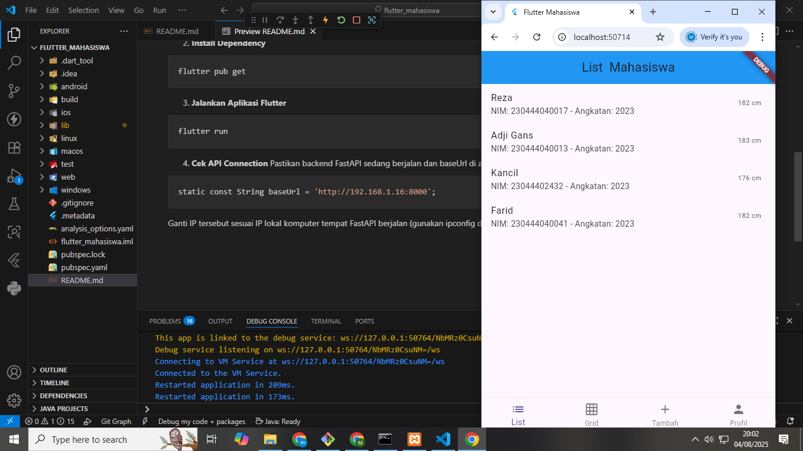
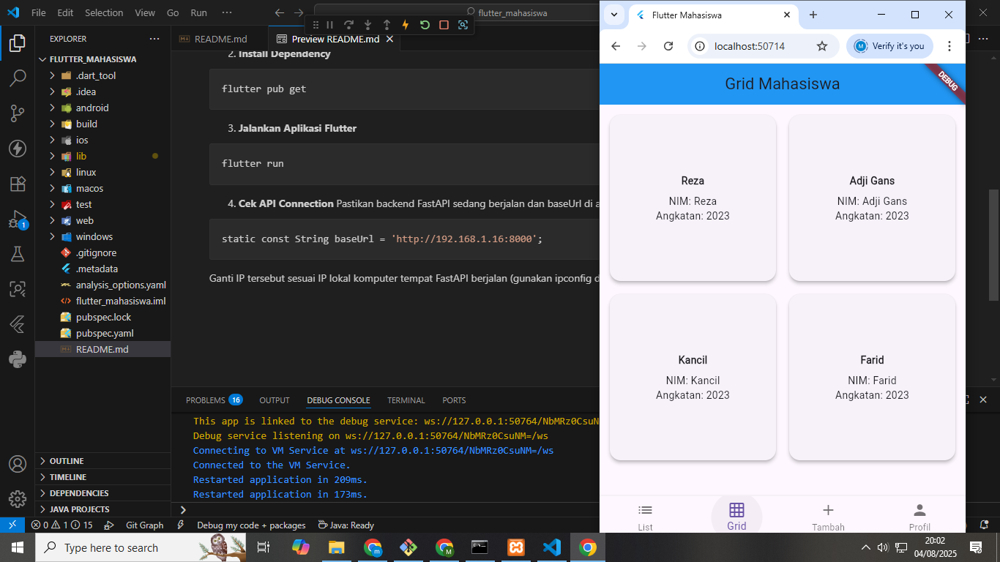
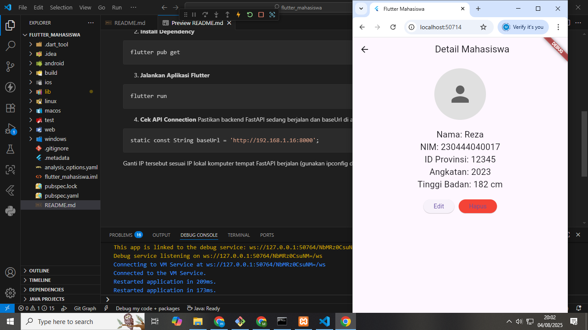
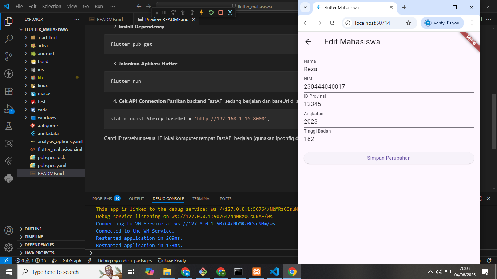
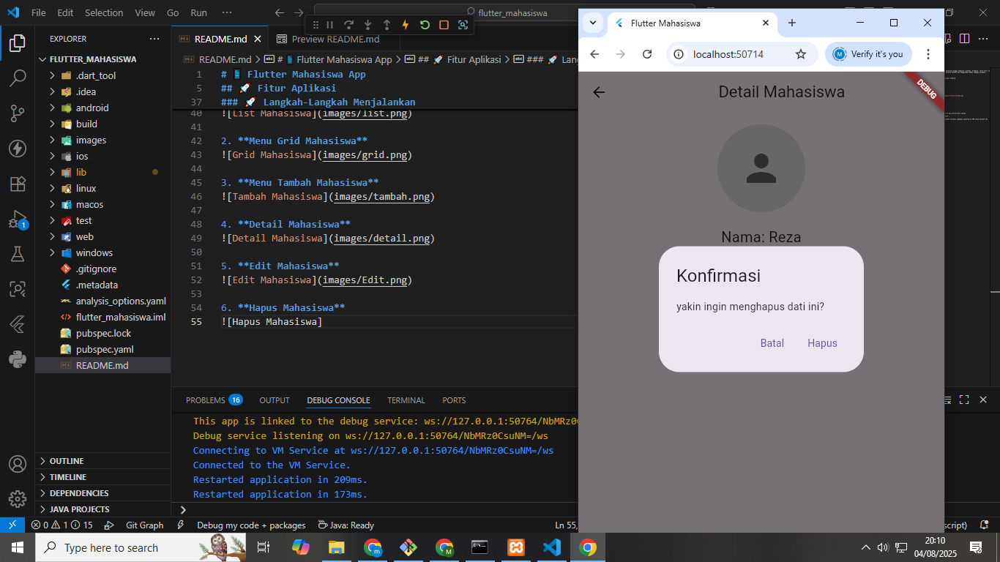
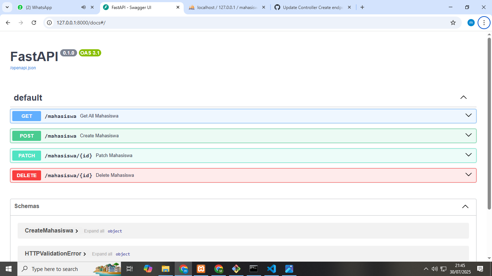

# MahasiswaConnect
## 📚 Tujuan
Proyek ini dibuat untuk belajar membangun REST API dan menghubungkannya dengan Flutter menggunakan HTTP request.
## 🚀 Cara Menjalankan 
Ikuti Langkah-langkah README.md yang sudah ada di folder webservice_fastapi dan flutter_mahasiswa
## 📱 Views
1. **Menu List Mahasiswa**

2. **Menu Grid Mahasiswa**

3. **Menu Tambah Mahasiswa**

4. **Detail Mahasiswa**

5. **Edit Mahasiswa**

6. **Hapus Mahasiswa**

6. **WebService**

