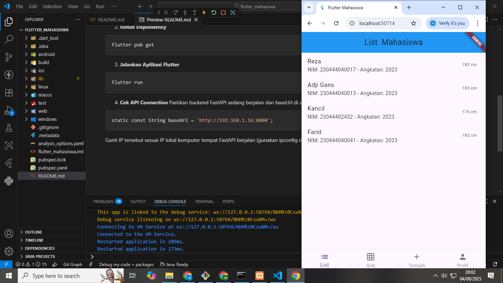
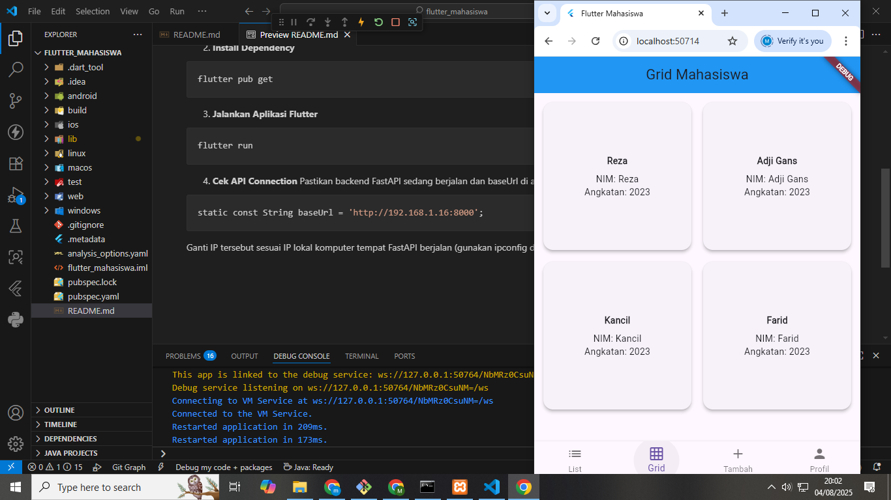
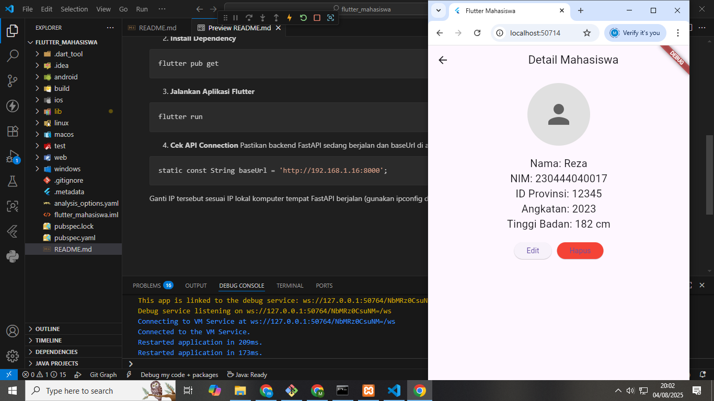
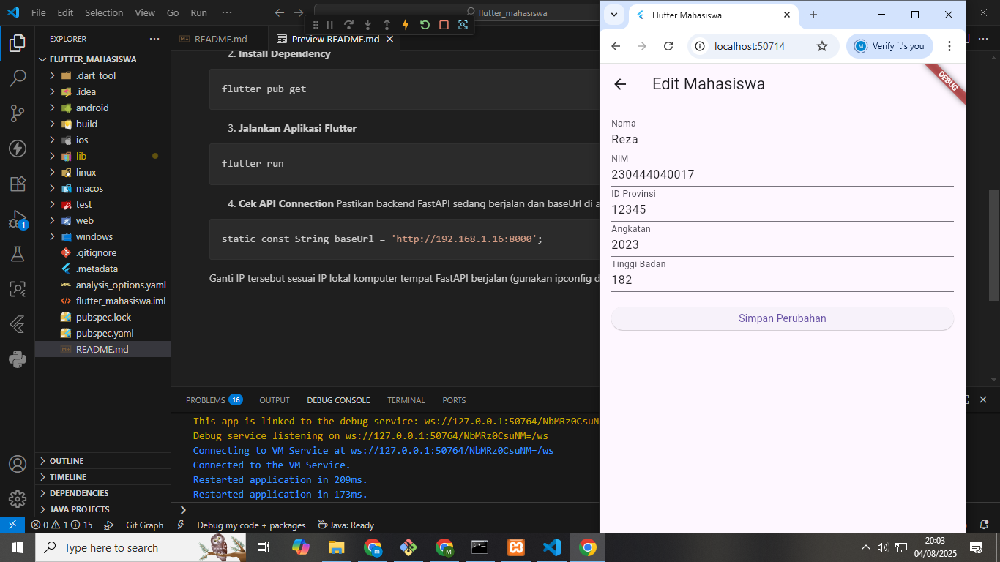
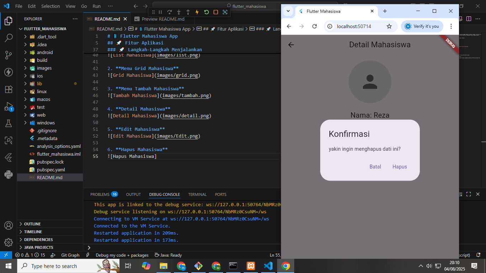

# 📱 Flutter Mahasiswa App

Aplikasi Flutter ini digunakan untuk mengelola data mahasiswa dengan tampilan ListView, GridView, serta fitur tambah, edit, dan hapus data. Aplikasi ini terhubung dengan backend FastAPI dan menggunakan MySQL sebagai database.

## 🚀 Fitur Aplikasi

- ✅ Menampilkan data mahasiswa dalam bentuk ListView dan GridView
- ➕ Tambah data mahasiswa
- ✏️ Edit data mahasiswa
- 🗑️ Hapus data mahasiswa
- 🔍 Melihat detail mahasiswa
- 📡 Terhubung dengan API FastAPI (Python)

### 💡 Langkah-Langkah Menjalankan

1. **Clone Repository**

```bash
git clone https://github.com/masadji12/mahasiswa-connect-flutter-fastapi.git
cd flutter_mahasiswa
```
2. **Install Dependency**
```bash
flutter pub get
```
3. **Jalankan Aplikasi Flutter**
```bash
flutter run
```
4. **Cek API Connection**
Pastikan backend FastAPI sedang berjalan dan baseUrl di api_service.dart sesuai:
```bash
static const String baseUrl = 'http://192.168.1.16:8000';
```
Ganti IP tersebut sesuai IP lokal komputer tempat FastAPI berjalan (gunakan ipconfig di CMD untuk melihat IP).

### 🚀 Langkah-Langkah Menjalankan

1. **Menu List Mahasiswa**


2. **Menu Grid Mahasiswa**


3. **Menu Tambah Mahasiswa**


4. **Detail Mahasiswa**


5. **Edit Mahasiswa**


6. **Hapus Mahasiswa**
