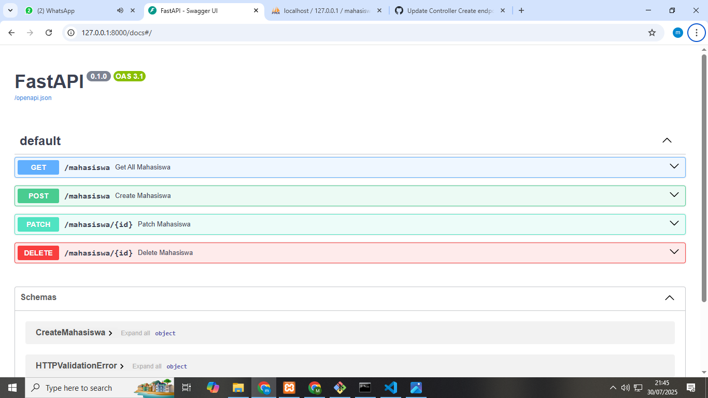

# Backend API - Mahasiswa Connect

Ini adalah backend REST API untuk aplikasi Mahasiswa Connect menggunakan FastAPI dan MySQL.

## 🚀 Teknologi
- FastAPI
- MySQL
- PyMySQL
- Uvicorn
- Pydantic

## ⚙️ Setup & Menjalankan Server

### 1. Install  dan Aktifkan Virtual Environment (opsional tapi disarankan)
#### 1.1 Install Virtual Env
```bash
python -m venv env
```
#### 1.2 AKtifkan Virtual Env
```bash
source env/bin/activate        # (Linux/Mac)
env\Scripts\activate           # (Windows)
```
### 2. Install Dependencies
```bash
pip install -r requirements.txt
```
### 3. Jalankan FastApi Server
```bash
uvicorn main:app --reload
uvicorn main:app --reload --host 0.0.0.0 --port 8000 # Jalan ini yang ini Setalah Poject flutter sudah siap diTesting
```
Server akan berjalan di http://127.0.0.1:8000 atau http://127.0.0.1:8000/docs


